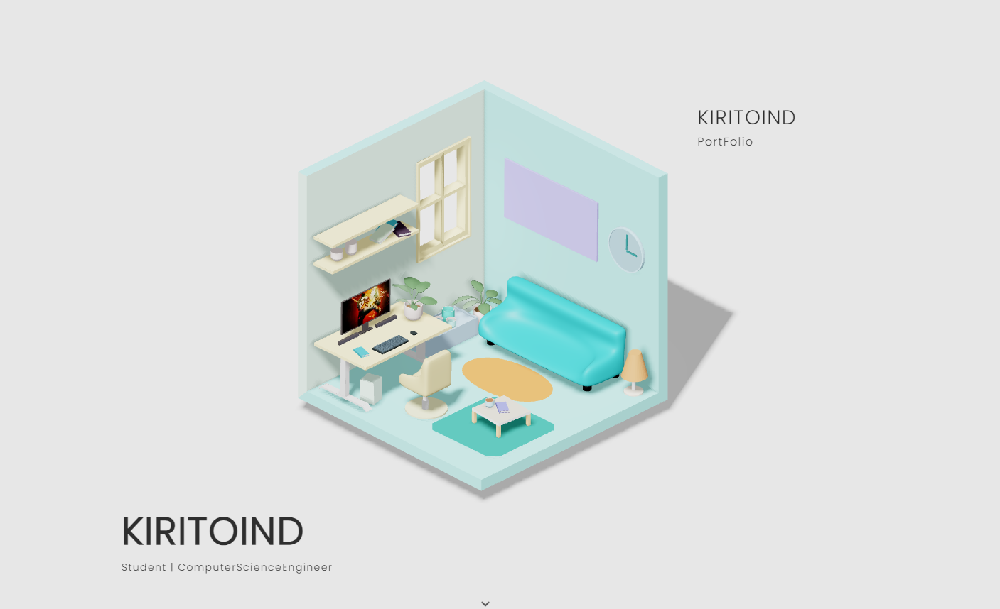

# Kiritoind-Bokoko-Portfolio

This is a 3D portfolio website created using Three.js. The project is inspired by the work of Andrew Woan and Bokoko.

## Credits

- **Andrew Woan**
  - [Andrew Woan's Github](https://github.com/andrewwoan)

- **Bokoko**
  - [Bokoko's Portfolio](https://bokoko33.me/)

## Portfolio Website

[Link to Your Portfolio Website](https://kiritoind-bokoko-portfolio.vercel.app/)

## Preview
**1**

**2**

## Description

This project is a showcase of my work and skills in a 3D environment. It leverages the power of Three.js to create an interactive and visually appealing portfolio experience.

## How to Run

1. Clone the repository.
2. Open the `index.html` file in a web browser.

## Dependencies

- [Three.js](https://threejs.org/)

## Acknowledgments

I would like to express my gratitude to Bokoko for the inspiration drawn from his portfolio and to Andrew Woan for their contributions to the portfolio .

Feel free to explore the code and adapt it for your own use. If you have any questions or suggestions, please [contact me](https://twitter.com/Shreyansh_2410).

Happy coding!
